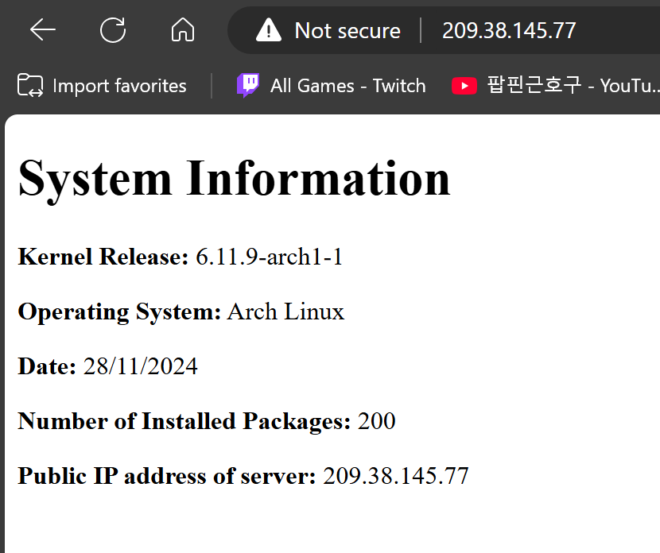

# 2420-assignment-3
## Table of Contents
1. [Introduction](#introduction)
2. [Instructions](#instructions)
3. [Web Server Result](#Web_Server_Result)

## Introduction
This is an Linux assignment where I have to create a web server by setting up a bash script that generates a static `index.html` file containing system information that will automatically run every day at 5:00 AM PST. Then displaying the `index.html` on a web server hosted on your Arch Linux droplet using Nginx. Additionally, it includes a `ufw` firewall configuration for system security.

In this repository, you will find a bash script named `setup` that will automatically set up all the files for the web server to work.


## Instructions
To start off, make sure you have the latest version of Linux. If not use the following command to install the latest version:
```
sudo pacman -Syu
```
Then reboot your system.
```
sudo systemctl reboot
```

Clone this repository into your home directory.
Use the following command to clone the repository:
```
https://github.com/Abungo-w/2420-assignment-3.git
```
Then go into the new directory you just cloned named `2420-assignment-3` and run the file named `setup`.
Use the following command to run the setup file:
```
sudo ./setup
```
> **_NOTE:_**  The setup might fail if you don't have your linux system up to date. Make sure to update it and reboot before you run the setup file!

## Web Server Result
This is what the webpage should look like when you enter your Arch Linux droplet IP address on a web browser.

